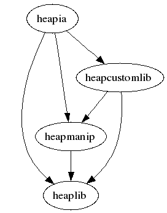

Architecture of Heapkeeper
==========================

This section describes the architecture of Heapkeeper. First it gives a
high-level overview of the system by summarizing the role of each module in a
few sentences. Then the tasks of the most important classes and functions are
explained. Finally it talks about the dependencies between the modules.

This section does not contain a detailed descriptions of the modules, classes
and functions: these descriptions can be found in the user documentation and
developer documentation of the modules.

Module structure
----------------

Heapkeeper consists of several Python modules. Each module is implemented in
the file ``<module>.py``.

:mod:`heaplib`
   Contains general library classes and functions.
:mod:`heapmanip`
   The database and business logic of Heapkeeper. Its classes can
   download, store, and modify posts and generate HTML from them.
:mod:`heapia`
   The interactive interface of Heapkeeper.
:mod:`heapcustomlib`
   Contains functions and classes that are useful for the parametrization of
   functions in other modules (especially functions of :mod:`heapmanip` and
   :mod:`heapia`).

The central modules are :mod:`heapmanip` and :mod:`heapia`. The former contains
the core functionality of Heapkeeper, while the latter provides the primary
user interface. The general library functions that are not related to the
concepts of Heapkeeper are collected in :mod:`heaplib`. Heapkeeper is a very
customizable tool: it can be customized primarily by writing Python functions.
The functions and classes of :mod:`heapcustomlib` help to implement these
custom functions.

We use unit tests to test the Heapkeeper's code, using the standard
``unittest`` module. Each module has a corresponding module that tests it.

:mod:`test_lib`
    Module that tests the :mod:`heaplib` module.
:mod:`test_heapmanip`
    Module that tests the :mod:`heapmanip` module.
:mod:`test_heapia`
    Module that tests the :mod:`heapia` module.
:mod:`test_heapcustomlib`
    Module that tests the :mod:`heapcustomlib` module.
:mod:`test`
    Module that tests all modules.

Module contents
---------------

Some objects will be renamed. The proposed new name of these objects is
written after their name in parens.

:mod:`heapmanip` (*hklib*)
^^^^^^^^^^^^^^^^^^^^^^^^^^

The main concept of Heapkeeper is the *heap*. The *heap* is an abstract data
structure that consists of *posts*. The *heap* data structure is implemented in
the :mod:`heapmanip` module.

Heapkeeper stores the *heap* on the disk. Each post is stored in a *post file*.
When Heapkeeper runs, the *heap* on the disk is read and the *heap* is stored
in the memory as a :class:`MailDB` object, which is called *post database*.
Each post is then stored in a :class:`Post` object, which we call *post object*
or just *post*. A post object can be re-written into its post file, and re-read
from its post file. A post is usually created from an email in the first place,
but later it may be modified in the *heap*.

:class:`Post <heapmanip.Post>`

    A :class:`Post <heapmanip.Post>` object (called a *post object*) represents
    a post.

    Each post has a unique id called *heapid*, which is a string. (Often a
    string that contains a number.) The post file of a post has the name
    ``<heapid>.mail``. The post object of a post stores its heapid in a data
    attribute.

    A post consists of a *header* and a *body*. The header contains
    *attributes*, which are key-value pairs. Certain keys may have multiple
    values, but not all. The concepts of header, body and attribute and similar
    to these concepts wrt. emails.
    
    Both the header and the body is stored in the post object as data members.
    They are stored in the post file similarly to the standard email file
    format (:rfc:`2822`), but a little modification. The format is described in
    the documentation of :func:`heapmanip.Post.parse` (not yet).

    A post may have a *message id*, which is an attribute in the header. The
    message id is the message id of the email from which the post was created.
    It is supposed to be unique.

    There are different relations between the posts: the most basic one is when
    a post is the child of another post. It usually means that the latter one
    is a reply to the former one. For more information about the relations, see
    :ref:`post_relations`.

:class:`MailDB` (*PostDB*)
    
    A :class:`MailDB <heapmanip.MailDB>` object (called a *post database*)
    represents the *heap*.
    
    

:class:`Server` (*EmailDownloader*)

    A :class:`Server` object can connect to an IMAP server, download new
    emails, create new posts based on the emails, and save them to the
    post database.

stored in Heapkeeper's database, which is called *the heap*. The heap is
stored in a set of text files; each file contains one post. Posts can be
    
:mod:`heapia`
^^^^^^^^^^^^^

:class:`Options <heapia.Options>`
    todo

Module dependencies
-------------------

Understanding which module uses which other modules may help a lot in
understanding the system itself. We say that a module depends on another if it
uses functions or classes defined in the other module.

The module dependencies are shown in the following picture:

Since :mod:`heaplib` contains general library functions, it does not use any
other modules of Heapkeeper, but all the other modules may use it. Both
:mod:`heapia` and :mod:`heapcustomlib` use :mod:`heapmanip`, since
:mod:`heapmanip` implements the data types that make the heap. :mod:`heapia`
uses :mod:`heapcustomlib` only for setting sensible default values for certain
callback functions.
