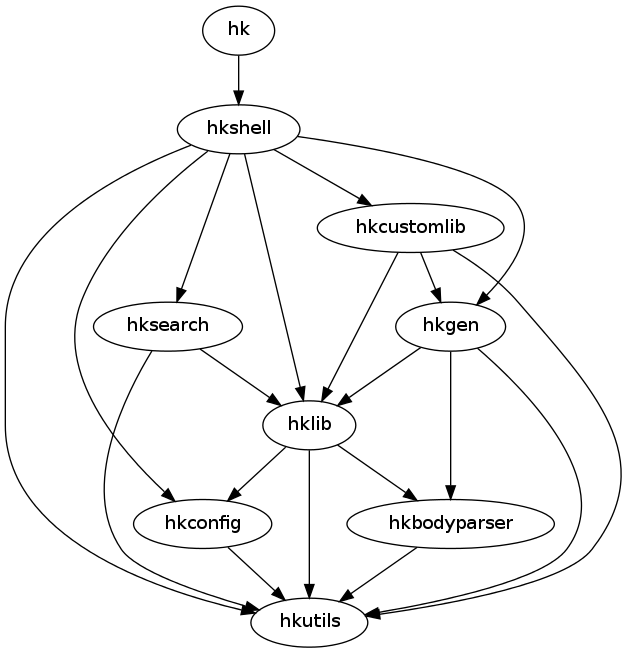

Architecture of Heapkeeper
==========================

This section describes the architecture of Heapkeeper. First it gives a
high-level overview of the system by summarizing the role of each module in a
few sentences. Then the tasks of the most important classes and functions are
explained. Finally it talks about the dependencies between the modules.

This section does not contain a detailed descriptions of the modules, classes
and functions: these descriptions can be found in the documentation of the
modules.

Module structure
----------------

Heapkeeper consists of several Python modules. Each module is implemented in
the file ``<module>.py``.

:mod:`hkutils`
    Contains general library classes and functions.
:mod:`hklib`
    The database and business logic of Heapkeeper. Its classes can
    download, store, and modify posts.
:mod:`hkgen`
    It generates HTML output from the posts on the heaps.
:mod:`hkshell`
    The interactive interface of Heapkeeper.
:mod:`hk`
    A small module whose only task is to invoke :mod:`hkshell`.
:mod:`hkcustomlib`
    Contains functions and classes that are useful for the parametrization of
    functions in other modules (especially functions of :mod:`hklib` and
    :mod:`hkshell`).
:mod:`issue_tracker`
    Generates HTML output that is like an issue tracker.
:mod:`hkrc_*`
    Initialization files of the developers. These module are not really part of
    Heapkeeper, but are kept in the Heapkeeper repository so that developers
    and users can learn from them, and developers can test if they break each
    other's hkrc.

The central modules are :mod:`hklib` and :mod:`hkshell`. The former contains
the core functionality of Heapkeeper, while the latter provides the primary
user interface. :mod:`hkgen` is also an important module, it generates HTML
pages from the post database. The general library functions that are not
related to the concepts of Heapkeeper are collected in :mod:`hkutils`.

Heapkeeper is a very customizable tool. :mod:`hkshell` can be customized
primarily by writing Python functions. The functions and classes of
:mod:`hkcustomlib` help to implement these custom functions. :mod:`hkgen` can
be customized by deriving own generator classes from the one in :mod:`hkgen`
and overriding some of its method. The :mod:`issue_tracker` is an example of
such a derived generator.

We use unit tests to test Heapkeeper's code, using the standard ``unittest``
module. Each module has a corresponding module that tests it.

:mod:`test_hkutils`
    Module that tests the :mod:`hkutils` module.
:mod:`test_hklib`
    Module that tests the :mod:`hklib` module.
:mod:`test_hkshell`
    Module that tests the :mod:`hkshell` module.
:mod:`test_hkcustomlib`
    Module that tests the :mod:`hkcustomlib` module.
:mod:`test`
    Module that tests all modules.

Module contents
---------------

:mod:`hklib`
^^^^^^^^^^^^

The main concept of Heapkeeper is the *heap*. The heap is an abstract data
structure that consists of *posts*. The heap data structure is implemented in
the :mod:`hklib` module.

Classes that implement and manipulate the heap
""""""""""""""""""""""""""""""""""""""""""""""

Heapkeeper stores the heap on the disk. Each post is stored in a *post file*.
When Heapkeeper runs, the heap on the disk is read and the heap is stored
in the memory as a :class:`PostDB <hklib.PostDB>` object, which is called
*post database*. Each post is then stored in a :class:`Post <hklib.Post>`
object, which we call *post object* or just *post*. A post object can be
re-written into its post file, and re-read from its post file. A post is
usually created from an email in the first place, but later it may be modified
in the heap.

:class:`hklib.Post`

    A :class:`Post <hklib.Post>` object (called a *post object*) represents
    a post.

    Each post has a unique id called *heapid*, which is a string. (Often a
    string that contains a number.) The post file of a post has the name
    ``<heapid>.mail``. The post object of a post stores its heapid in a data
    attribute.

    A post consists of a *header* and a *body*. The header contains
    *attributes*, which are key-value pairs. Certain keys may have multiple
    values, but not all. The concepts of header, body and attribute and similar
    to these concepts wrt. emails.

    Both the header and the body is stored in the post object as data members.
    They are stored in the post file similarly to the standard email file
    format (:rfc:`2822`), but a little modification. The format is described in
    the documentation of :func:`hklib.Post.parse` (not yet).

    A post may have a *message id*, which is the ``Message-Id`` attribute in
    the header. The message id is the message id of the email from which the
    post was created. It is supposed to be unique.

    There are different relations between the posts: the most basic one is when
    a post is the child of another post. It usually means that the latter one
    is a reply to the former one. This information is stored in the
    ``In-Reply-To`` attribute of the header of the child post: this attribute
    contains the heapid or message id of the parent of the post. If there is no
    post with such heapid or message id, or it is ``None``, the post does not
    have a parent. For more information about the relations, see
    :ref:`post_relations`.

    A post may have *tags*, which tell us information about the topic of the
    post. They are written into brackets when displayed: ``[computer
    science]``, ``[humor]``. If the subject of an email contains character
    sequences in brackets, they will be parsed as tags. The post created from
    the email will contain the tags as tags, and the subject of the post will
    not contain them. E.g. if the subject of the email was ``[humor][computer]
    The Website Is Down``, the subject of the post will be ``The Website Is
    Down``, but the post will have tag ``[humor]`` and tag ``[computer]``.

    A post may have *flags*, which tells Heapkeeper special information about
    the post. Currently there is only one flag, the ``deleted`` flag. When a
    post is deleted, it will not be removed entirely: the corresponding post
    object and post file will not be removed from the memory and the disk. The
    post will only obtain a ``deleted`` flag instead. It will keep its heapid
    and message id; this way we achieve that no other post will have the same
    heapid ever [#same_heapid]_. To save space and time, most attributes and
    the body of the post will be deleted, so the deletion cannot really be
    undone by Heapkeeper. Heapkeeper's database will handle deleted posts as if
    they would not exist, except that their heapid is reserved.

    The body of a post is currently a plain string. We plan to parse this
    string so that we can identify quotes (lines that start with ``>``),
    footnotes (e.g. ``This page [1] says:``) and so-called *meta text* (text
    written between ``<<<`` and ``>>>``). Meta text is either meta information
    about the post for the readers or the maintainers of the heap (e.g.
    ``<<<todo The subject of this email should be corrected>>>``), or command
    that should be processed by Heapkeeper (e.g. ``<<<!delpost>>>``, which
    means that the current post should be deleted).

:class:`hklib.PostDB` (*PostDB*)

    A :class:`PostDB <hklib.PostDB>` object (called a *post database*)
    represents the heap in the memory. It stores the post object of all
    posts. During initialization, it reads all the post files from the disk and
    creates the corresponding post objects. It can write the modified post
    files back at any time, or it can reload them from the disk.

    The post database calculates and stores the *thread structure*. The thread
    structure is a forest where the nodes are posts and the connections are
    :ref:`parent-child relations <post_relations>` between them. (Forest is a
    tree-like structure where having a root node it not necessary). The roots
    of the forest are the posts without parents. There may be posts that are
    excluded from the thread structure because they are in :ref:`cycles
    <cycle>`.

    The users of the post database can use the dictionary that describes the
    thread structure directly in order to get thread information. There are
    methods in :class:`PostDB <hklib.PostDB>`, however, that make obtaining
    most thread information easier. E.g. there are methods for calculating the
    root, the parent and the children of a post. There are also methods to find
    the cycles in the thread structure.

:class:`PostSet <hklib.PostSet>`

    todo

:class:`hklib.EmailDownloader`

    A :class:`EmailDownloader <hklib.EmailDownloader>` object can connect to an
    IMAP server, download new emails, create new posts based on the emails, and
    save them to the post database.

It may help to make a comparison between Heapkeeper and a program
that implements a relational database, e.g. MySQL:

+----------------------------------+-------------------------+
| Heapkeeper                       | MySQL                   |
+==================================+=========================+
| heap                             | relation database       |
+----------------------------------+-------------------------+
| :class:`PostDB <hklib.PostDB>`   | a data table            |
+----------------------------------+-------------------------+
| :class:`Post <hklib.Post>`       | a row in the data table |
+----------------------------------+-------------------------+
| Python                           | query language (SQL)    |
+----------------------------------+-------------------------+
| :class:`PostSet <hklib.PostSet>` | result of a query       |
+----------------------------------+-------------------------+

:mod:`hkshell`
^^^^^^^^^^^^^^

:class:`Options <hkshell.Options>`
    todo

Module dependencies
-------------------

Understanding which module uses which other modules may help a lot in
understanding the system itself. We say that a module depends on another if it
uses functions or classes defined in the other module.

The module dependencies are shown in the following picture:

Since :mod:`hkutils` contains general library functions, it does not use any
other modules of Heapkeeper, but all the other modules may use it.
:mod:`hkshell`, :mod:`hkgen` and :mod:`hkcustomlib` all use :mod:`hklib`, since
:mod:`hklib` implements the data types that make the heap. :mod:`hkshell`
uses :mod:`hkcustomlib` only for setting sensible default values for certain
callback functions. :mod:`hkcustomlib` implements a callback function to
generate posts that invokes :mod:`hkgen`, but sometimes :mod:`hkshell` calls
into :mod:`hkgen` directly.

.. _testing:

Testing
-------

We use unit tests to test Heapkeeper's code, using the standard ``unittest``
module. Each module has a corresponding module that tests it. Our aim is to
reach almost 100% statement coverage. (Currently we have 74%, measured with
``coverage.py``.)

All tests can be executed using the :mod:`test` module:

.. code-block:: none

    $ python test.py

.. rubric:: Footnotes

.. [#same_heapid]
    Why is it important that heapids cannot be recycled? Imagine the following
    situation: the ``In-Reply-To`` field of post ``y`` contains the heapid of
    ``x``, so ``x`` is the parent of ``y``. Then we delete ``x``: ``y`` does
    not have a parent now. If a new post ``z`` would be created with the heapid
    of ``x``, Heapkeeper would think it is the parent of ``y``, altough they
    may have nothing to do with each other.
