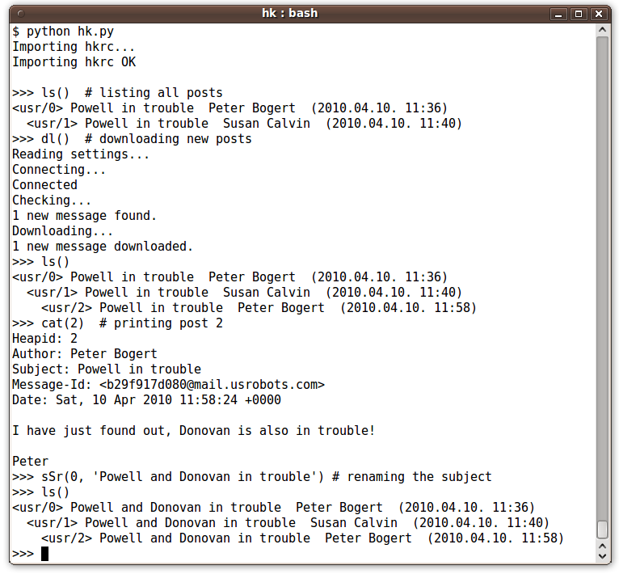

Screenshots and a real heap
===========================

Using Heapkeeper's shell to download new posts and modify them:

.. .. Text in the screenshot:

.. .. $ python hk.py
.. .. Importing hkrc...
.. .. Importing hkrc OK
.. ..
.. .. >>> ls()  # listing all posts
.. .. <usr/0> Powell in trouble  Peter Bogert  (2010.04.10. 11:36)
.. ..   <usr/1> Powell in trouble  Susan Calvin  (2010.04.10. 11:40)
.. .. >>> dl()  # downloading new posts
.. .. Reading settings...
.. .. Connecting...
.. .. Connected
.. .. Checking...
.. .. 1 new message found.
.. .. Downloading...
.. .. 1 new message downloaded.
.. .. >>> ls()
.. .. <usr/0> Powell in trouble  Peter Bogert  (2010.04.10. 11:36)
.. ..   <usr/1> Powell in trouble  Susan Calvin  (2010.04.10. 11:40)
.. ..     <usr/2> Powell in trouble  Peter Bogert  (2010.04.10. 11:58)
.. .. >>> cat(2)  # printing post 2
.. .. Heapid: 2
.. .. Author: Peter Bogert
.. .. Subject: Powell in trouble
.. .. Message-Id: <b29f917d080@mail.usrobots.com>
.. .. Date: Sat, 10 Apr 2010 11:58:24 +0000
.. ..
.. .. I have just found out, Donovan is also in trouble!
.. ..
.. .. Peter
.. .. >>> sSr(0, 'Powell and Donovan in trouble') # renaming the subject
.. .. >>> ls()
.. .. <usr/0> Powell and Donovan in trouble  Peter Bogert  (2010.04.10. 11:36)
.. ..   <usr/1> Powell and Donovan in trouble  Susan Calvin  (2010.04.10. 11:40)
.. ..     <usr/2> Powell and Donovan in trouble  Peter Bogert  (2010.04.10. 11:58)
.. .. >>>

An index page of a heap:

.. image:: images/1.png
      :align: center

HTML page of a thread:

.. image:: images/2.png
      :align: center

Have a look at the `web page generated from the Heapkeeper Heap`__, and `the
database of the Heapkeeper Heap`__.

__ http://github.com/hcs42/heapkeeper-heap
__ http://heapkeeper-heap.github.com

If you like the screenshots, it may be a good idea to continue with the
:doc:`tutorial`, where you can find explanations and more screenshots.
