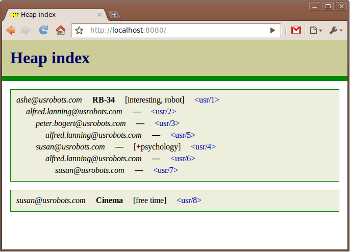
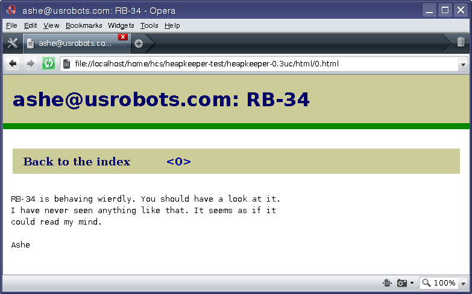
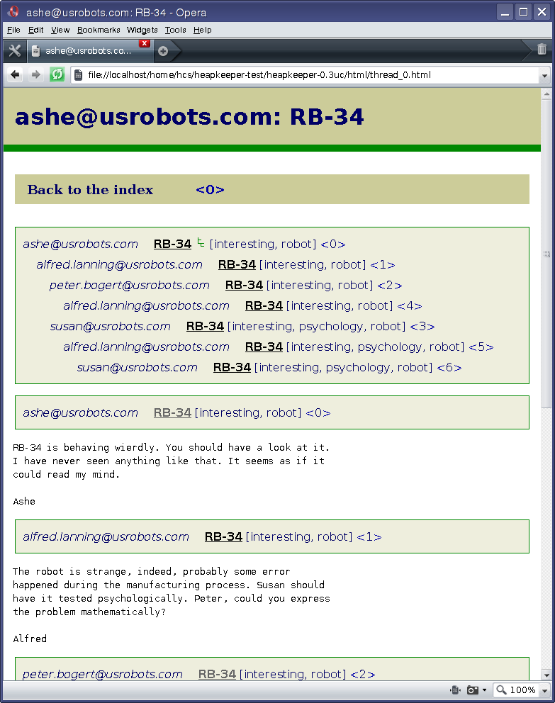
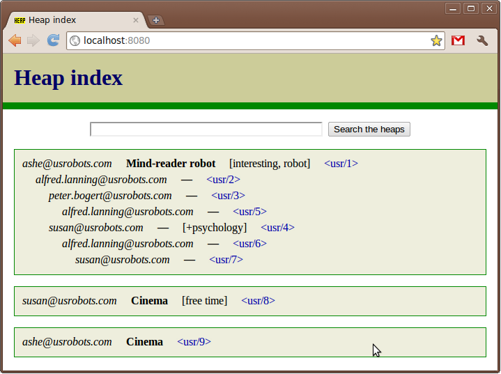
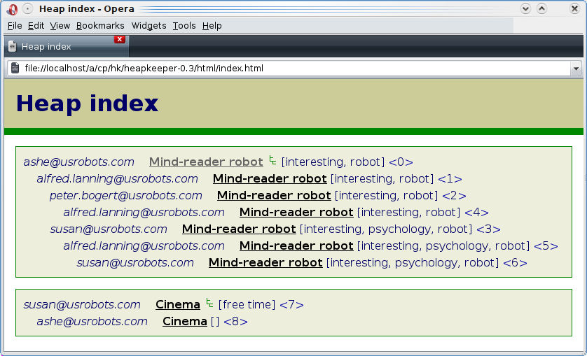

Tutorial
========

.. |aTr| replace:: :func:`aTr <hkshell.aTr>`
.. |aT| replace:: :func:`aT <hkshell.aT>`
.. |cat| replace:: :func:`cat <hkshell.cat>`
.. |enew_str| replace:: :func:`enew_str <hkshell.enew_str>`
.. |enew| replace:: :func:`enew <hkshell.enew>`
.. |expf| replace:: :func:`expf <hklib.PostSet.expf>`
.. |forall| replace:: :func:`forall <hklib.PostSet.forall>`
.. |ga| replace:: :func:`ga <hkshell.ga>`
.. |hkshell| replace:: :mod:`hkshell`
.. |j| replace:: :func:`j <hkshell.j>`
.. |ls| replace:: :func:`ls <hkshell.ls>`
.. |ps| replace:: :func:`ps <hkshell.ps>`
.. |q| replace:: :func:`q <hkshell.q>`
.. |rTr| replace:: :func:`rTr <hkshell.rTr>`
.. |rT| replace:: :func:`rT <hkshell.rT>`
.. |sSr| replace:: :func:`sSr <hkshell.sSr>`
.. |sS| replace:: :func:`sS <hkshell.sS>`
.. |s| replace:: :func:`s <hkshell.s>`
.. |x| replace:: :func:`x <hkshell.x>`
.. .. |XX| replace:: :func:`XX <hkshell.XX>`

Downloading Heapkeeper
----------------------

Download the latest version of Heapkeeper (either in `tar.gz`__ or in `zip`__).
For Unix users:

.. code-block:: sh

    $ wget http://heapkeeper.org/releases/heapkeeper-0.3uc.tar.gz

__ http://heapkeeper.org/releases/heapkeeper-0.3uc.tar.gz
__ http://heapkeeper.org/releases/heapkeeper-0.3uc.zip

Unzip the tar.gz or zip file. For Unix users:

.. code-block:: sh

    $ tar xzf heapkeeper-0.3uc.tar.gz

Make Heapkeeper's directory the current one. Heapkeeper's shell (|hkshell|) can
be started from here without any installation procedure. You can ask for
version information for example:

.. code-block:: sh

    $ cd heapkeeper-0.3uc
    $ python hk.py --version
    Heapkeeper version 0.3uc

Configuration
-------------

First, we create two directories: ``posts`` and ``html``. ``posts`` will store
the post database, which contains the posts themselves in text files. The
``html`` directory will contain the HTML pages that will be generated from the
posts.

.. code-block:: sh

    $ mkdir posts
    $ mkdir html

Heapkeeper needs a file called ``hk.cfg`` in which its settings are stored.
We set the directories that we just created to be used as post database and
HTML generation target.

.. code-block:: ini

    [paths]
    mail=posts
    html=html

Adding a new post to the heap
-----------------------------

Normally, the posts on the heap are emails that were downloaded from IMAP
servers and converted into a post. To make it easier to understand this
tutorial, first we will create and manipulate posts locally by |hkshell|
commands. (Afterwards we will go through on how to download emails from a
mailing list, which makes Heapkeeper actually usable.)

Start |hkshell|:

.. code-block:: sh

    $ python hk.py
    Importing hkrc...
    Module not found: "hkrc"

    >>>

The output informs us that |hkshell| did not find the customization module
(``hkrc``), but that is all right. The last line indicates that we got a Python
prompt where we can type any Python statement. Actually, |hkshell| commands are
Python functions imported into the global namespace.

Let's list all the posts we have (of course we don't have any posts yet)::

    >>> postdb().all()
    PostSet([])
    >>>

Let's create now a new post with the |enew| command::

    >>> enew()

An editor will pop up (``gvim`` by default) and the following template:

.. code-block:: none

    Author:
    Subject:

Paste this in place of the template:

.. code-block:: none

    Author: ashe@usrobots.com
    Subject: RB-34
    Tag: interesting
    Tag: robot

    RB-34 is behaving wierdly. You should have a look at it.
    I have never seen anything like that. It seems as if it
    could read my mind.

    Ashe

The post specifies the author and the subject, which are the same concepts as
in emails. Posts may also have any number of tags; this post has two tags. The
header is closed with an empty line, which is followed by the body of the post.
This structure is similar to the standard email file format (:rfc:`2822`).

After saving and quitting from the text editor, we should see confirmation
about the post's successful creation::

    >>> enew()
    Post created.
    <post '0'>
    >>>

At this point, the post exists only in the memory. We use the :func:`s
<hkshell.s>` command to save everything to the disk::

    >>> s()
    >>>

A file called ``0.post`` has been created in the ``posts`` directory. It
contains exactly what we pasted into the text editor. Let's quit from
Heapkeeper with the |x| command and examine ``posts/0.post``:

.. code-block:: none

    >>> x()
    $ ls posts/
    0.post
    $ cat posts/0.post
    Author: ashe@usrobots.com
    Subject: RB-34
    Tag: interesting
    Tag: robot

    RB-34 is behaving wierdly. You should have a look at it.
    I have never seen anything like that. It seems as if it
    could read my mind.

    Ashe

Adding new posts to the heap from outside hkshell
-------------------------------------------------

The post database on the disk (i.e. the post directory) can be manipulated by
hand. (Heapkeeper is not running now, so we will not interfere with it.) Let's
create a few more posts to make the thread structure more interesting. The
``Parent`` attribute is used to specify the parent of a post -- to which the
current post is a reply.

The following Unix shell commands can be copy-pasted into the terminal or a
shell script file. They will create the posts we will work with.

.. code-block:: sh

    cat >posts/1.post <<EOF
    Author: alfred.lanning@usrobots.com
    Parent: 0
    Subject: Re: RB-34
    Tag: robot
    Tag: interesting

    The robot is strange, indeed, probably some error
    happened during the manufacturing process. Susan should
    have it tested psychologically. Peter, could you express
    the problem mathematically?

    Alfred
    EOF

    cat >posts/2.post <<EOF
    Author: peter.bogert@usrobots.com
    Parent: 1
    Subject: Re: RB-34
    Tag: robot
    Tag: interesting

    Yes, sure.

    Peter
    EOF

    cat >posts/3.post <<EOF
    Author: susan@usrobots.com
    Parent: 1
    Subject: Re: RB-34
    Tag: robot
    Tag: interesting
    Tag: psychology

    I have talked to the robot. It likes reading only novels
    and other literature, it is not interested in natural
    sciences. It is very bright, though.

    Susan
    EOF

    cat >posts/4.post <<EOF
    Author: alfred.lanning@usrobots.com
    Parent: 2
    Subject: Re: RB-34
    Tag: robot
    Tag: interesting

    Peter, have you made any progress?

    Alfred
    EOF

    cat >posts/5.post <<EOF
    Author: alfred.lanning@usrobots.com
    Parent: 3
    Subject: Re: RB-34
    Tag: robot
    Tag: interesting
    Tag: psychology

    Susan, what do you mean by bright?

    Alfred
    EOF

    cat >posts/6.post <<EOF
    Author: susan@usrobots.com
    Parent: 5
    Subject: Re: RB-34
    Tag: robot
    Tag: interesting
    Tag: psychology

    I mean it is understands natural sciences very well, it
    just does not care.

    Susan
    EOF

    cat >posts/7.post <<EOF
    Author: susan@usrobots.com
    Subject: Cinema
    Tag: free time

    Other subject. Does anyone feel like going to the cinema?

    Susan
    EOF

Generating HTML pages
---------------------

The posts and the threads can be visualized in HTML using the |ga| command (it
stands for "generate all")::

    $ python hk.py
    Importing hkrc...
    Module not found: "hkrc"

    >>> ga()
    Indices generated.
    Thread HTMLs generated.
    Post HTMLs generated.
    >>>

Open ``html/index.html`` in a browser. You will see something like this:

This is called an *index page*, because it contains an index of the posts. Every
post has a one line summary. These post summaries are sorted into boxes: every
box is a thread. Now there are only two threads, the second of which contains
only one post. In the first box, the posts are ordered in a threaded structure:
for example both post 2 and 3 are replies to post 1.

A post summary shows the author, the subject, the tags and the id (so-called
*heapid*) of the post. The subjects are links, so we can click on them to read
the post pages. If we click on the subject of the first post, the following page
will be shown to us:

In the index page, every thread has a little tree image next to the subject and
tags of the post summary of the root of that thread. If we click on it, we will
see all the posts of that thread expanded in an HTML page. We will see the
following page if we click on the tree image of the first thread:

This page displays one thread. The top of the page contains the post summaries
of the posts in the thread. The rest shows all the posts together with their
body.

Modifying the heap with |hkshell|
---------------------------------

The collection of the posts is called the *heap*. One of Heapkeeper's aims is to
make it easy to perform operations of large amount of posts. Theoretically, you
can do anything you want with the post database that is stored in the post
files: you can use text editors, Unix text processing tools to modify the heap,
or even write own scripts and programs.

A more convenient way to do this is to use Heapkeeper's shell and API. We
already used the former one to create a new post and to generate the HTML pages.
Now we will use it to perform more complicated operations.

|hkshell| commands
""""""""""""""""""

The most common operations can be performed quite easily using the appropriate
|hkshell| command. (We already used the |enew|, |s|, |x| and |ga| commands.)
These commands are very high-level. Not everything can be done with them, they
are only handy shortcuts. They are to be used often, so they all have fairly
short names that are essentially mnemonics. See the list of |hkshell| commands
:ref:`here <hkshell_commands>`.

|ls| and |cat|
::::::::::::::

First let's have a look at the |ls| command. It prints out the header of given
post or posts, which can be specified for example by their heapid (or are all
posts by default)::

    >>> ls(0)
    <0> RB-34  ashe@usrobots.com
    >>> ls([0,1])
    <0> RB-34  ashe@usrobots.com
    <1> RB-34  alfred.lanning@usrobots.com

The |cat| command prints the post itself::

    >>> cat(0)
    Heapid: 0
    Author: ashe@usrobots.com
    Subject: RB-34
    Tag: interesting
    Tag: robot

    RB-34 is behaving wierdly. You should have a look at it.
    I have never seen anything like that. It seems as if it
    could read my mind.

    Ashe

Manipulating the subject and tags
:::::::::::::::::::::::::::::::::

Now let's have a look at the commands that actually modify the posts. For
example the |sS| command ("set subject") sets the subject of the given posts. An example::

    >>> sS([0,1], 'Robot Problem: RB-34')
    >>> ls()
    <0> Robot Problem: RB-34  ashe@usrobots.com
    <1> Robot Problem: RB-34  alfred.lanning@usrobots.com
    <2> RB-34  peter.bogert@usrobots.com
    <3> RB-34  susan@usrobots.com
    <4> RB-34  alfred.lanning@usrobots.com
    <5> RB-34  alfred.lanning@usrobots.com
    <6> RB-34  susan@usrobots.com
    <7> Cinema  susan@usrobots.com

There is a recursive version of |sS| that is called |sSr| ("set subject
recursively"). It changes not only the subject of the given post, but the
subject of all its descendants. For example, to change the subject of all
emails in the "Robot" thread, we can set the subject of the root post
recursively, and all posts' subject will be set::

    >>> sSr(0, 'Mind-reader robot')
    >>> ls()
    <0> Mind-reader robot  ashe@usrobots.com
    <1> Mind-reader robot  alfred.lanning@usrobots.com
    <2> Mind-reader robot  peter.bogert@usrobots.com
    <3> Mind-reader robot  susan@usrobots.com
    <4> Mind-reader robot  alfred.lanning@usrobots.com
    <5> Mind-reader robot  alfred.lanning@usrobots.com
    <6> Mind-reader robot  susan@usrobots.com
    <7> Cinema  susan@usrobots.com

There are similar functions to control tags, for example |aT| ("add tag"),
|aTr| ("add tag recursively"), |rT| ("remove tag") and |rTr| ("remove tag
recursively").

The |j| command: joining posts
::::::::::::::::::::::::::::::

The thread structure can also be changed: the |j| command joins two posts. It
means that the second post will be a child of the first post. It does not
matter whether it had another parent before or it had no parent.

Let's write an answer to the "Cinema" post, but let's forget to mention that it
should be the child of that post! (This happens often in real life with email
clients, especially when people modify the subject of the email they are
answering to.) Let's use the |enew_str| function to create the new post. It
works like |enew|, but receives the content of the post as an argument::

    >>> enew_str("Author: ashe@usrobots.com\n"
    ...          "Subject: Cinema\n"
    ...          "\n"
    ...          "Yes, I'd like to go!\n"
    ...          "\n"
    ...          "Ashe\n")
    >>> ga()
    Indices generated.
    Thread HTMLs generated.
    Post HTMLs generated.

The generated page will look like this:

Let's join post 7 and 8 and regenerate the index page::

    >>> j(7,8)
    >>> ga()
    Indices generated.
    Thread HTMLs generated.
    Post HTMLs generated.
    >>>

On the new index page, we will see that the two "Cinema" posts are in one
thread now, and post 7 is the parent of post 8:

Post sets
"""""""""

Most |hkshell| commands take a postset as an argument. A postset can be
given in several ways. We saw examples of the followings:

* the heapid as an integer (e.g. ``sS(42, 'something')``)
* the heapid as a string (e.g. ``sS('43', 'something')``)
* a list or set of strings and integers (e.g. ``sS([42, '43'], 'something')``)

In these cases, the set of posts is created from the given integers and
strings. The postset can also be created explicitly, using the ``ps``
function::

    >>> posts = ps([7,8])
    >>> print posts
    PostSet([<post '7'>, <post '8'>])
    >>> sS(posts,'Cinema???')
    >>> ls(posts)
    <7> Cinema???  susan@usrobots.com
    <8> Cinema???  ashe@usrobots.com
    >>>

:func:`postdb().all() <hklib.PostSet.all>` returns a postset that contains all
posts. In the following example, we use it to add the ``internal`` tag to all
posts::

    >>> ls(show_tags=True, show_author=False)
    <0> Mind-reader robot  [interesting,internal,robot]
    <1> Mind-reader robot  [interesting,internal,robot]
    <2> Mind-reader robot  [interesting,internal,robot]
    <3> Mind-reader robot  [interesting,internal,psychology,robot]
    <4> Mind-reader robot  [interesting,internal,robot]
    <5> Mind-reader robot  [interesting,internal,psychology,robot]
    <6> Mind-reader robot  [interesting,internal,psychology,robot]
    <7> Cinema???  [free time,internal]
    <8> Cinema???  [internal]

.. .. We can create post sets (:class:`hklib.PostSet` objects) using the |ps|
.. .. command::
.. .. 
.. ..     >>> p = ps([1,2])
.. ..     >>> p
.. ..     PostSet([<post '1'>, <post '2'>])
.. ..     >>>
.. .. 
.. .. We can print the most important information about them using the |ls| command::
.. .. 
.. ..     >>> ls(p)
.. ..     <1> alfred.lanning@usrobots.com  RB-34
.. ..     <2> peter.bogert@usrobots.com  RB-34
.. .. 
.. .. There are many things we can do with a post set. It has standard set operations
.. .. like union, intersection, etc; but it also has operations that are specific to
.. .. Heapkeeper. For example :func:`p.expf() <hklib.PostSet.expf>` returns a post set
.. .. that contains all posts of `p` and all their descendants::
.. .. 
.. ..     >>> p.expf()
.. ..     PostSet([<post '4'>, <post '1'>, <post '2'>, <post '6'>, <post '3'>,
.. ..     <post '5'>])
.. .. 
.. .. Post sets also have a |forall| attribute that behaves in a tricky way.
.. .. Whatever operation is performed on them, it will be performed on all posts
.. .. belonging to the post set. In the following example, we use |expf| and |forall|
.. .. to rename the subject in a whole thread; i.e. renaming the subject of all posts
.. .. belonging to that thread.::
.. .. 
.. ..     >>> for p in range(0,8): ls(p)
.. ..     ...
.. ..     <0> RB-34  ashe@usrobots.com
.. ..     <1> RB-34  alfred.lanning@usrobots.com
.. ..     <2> RB-34  peter.bogert@usrobots.com
.. ..     <3> RB-34  susan@usrobots.com
.. ..     <4> RB-34  alfred.lanning@usrobots.com
.. ..     <5> RB-34  alfred.lanning@usrobots.com
.. ..     <6> RB-34  susan@usrobots.com
.. ..     <7> Cinema  susan@usrobots.com
.. ..     >>> ps(0).expf().forall.set_subject("Mind-reader robot")
.. ..     >>> for p in range(0,8): ls(p)
.. ..     ...
.. ..     <0> Mind-reader robot  ashe@usrobots.com
.. ..     <1> Mind-reader robot  alfred.lanning@usrobots.com
.. ..     <2> Mind-reader robot  peter.bogert@usrobots.com
.. ..     <3> Mind-reader robot  susan@usrobots.com
.. ..     <4> Mind-reader robot  alfred.lanning@usrobots.com
.. ..     <5> Mind-reader robot  alfred.lanning@usrobots.com
.. ..     <6> Mind-reader robot  susan@usrobots.com
.. ..     <7> Cinema  susan@usrobots.com
.. ..     >>>
.. .. 
.. .. Todo:
.. .. 
.. .. * another idea: adding a signature to all my emails
.. .. 
.. .. Todo for new sections:
.. .. 
.. .. * Creating a heap (with a Google Groups account and GMail account).
.. .. * Maybe: posting a few emails in order to create a non-trivial thread structure.
